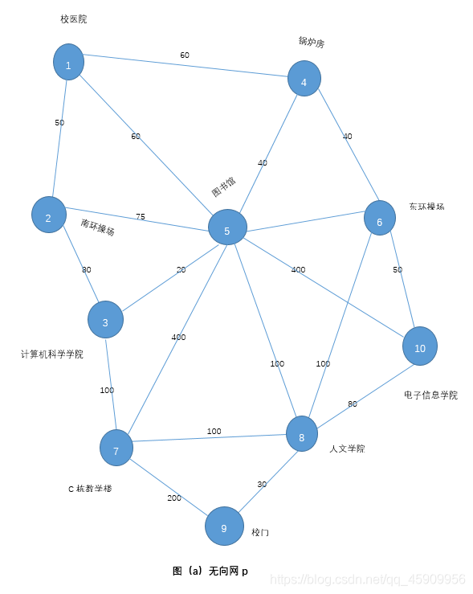

<!--
 * @Description: 编程过程中记录学到的东西
 * @Author: HailayLin
 * @Date: 2021-12-12 16:04:10
 * @LastEditTime: 2021-12-12 19:03:03
 * @FilePath: \DataStructClassDesign\readme.md
-->
# 数据结构课程设计：校园导航
* 源程序里面不写技术问题，在这里写，不然显得代码很乱

## 协作编辑
### vscode share live
https://docs.microsoft.com/zh-cn/visualstudio/liveshare/use/vscode#session-states-and-limitations

### wps
https://www.kdocs.cn/l/ckOwnCUpPGqn

## 编码规范
google
https://zh-google-styleguide.readthedocs.io/en/latest/google-cpp-styleguide/contents/

## markdown
* 写可以忽略格式问题
* 加入图片、代码片段

## 框架设计问题
### 游客模式和管理员模式
* @林 可以合在一起，用菜单选择就好，不考虑登录鉴权问题：密码匹配、密码安全存储等问题


## 编程问题
### 多头文件引入
http://c.biancheng.net/cpp/html/469.html pragma 预处理
````cpp
#pragma once
#include<stdio.h>
using namespace std;
````

### 多文件编译
## g++/gcc 编译文件过程
源代码——预处理——编译（宏定义替换后代码）——汇编（汇编代码）——链接（二进制代码）——.exe/a.out

## 自动构建
cmake https://zhuanlan.zhihu.com/p/52874931
xmake https://github.com/xmake-io/xmake/blob/master/README_zh.md

参考文献 

C语言编程中文网 http://c.biancheng.net/cplus/more_file/

阮一峰 http://www.ruanyifeng.com/blog/2015/02/make.html

makefile
http://c.biancheng.net/makefile/

## g++ 编译代码（简单版）
````shell
g++ main.cc welcome.cc -o a.exe (.cc那边把所有.cc文件包含进去)
````

# 参考别人做好的样本
在OneNote

